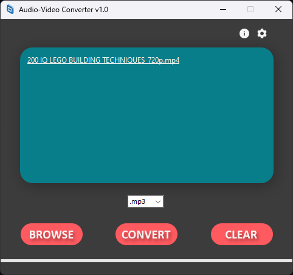

## **Audio-Video Converter**

Python application for converting audio and video files using FFmpeg. 
It provides a user-friendly interface to select files for conversion, 
choose output formats, and monitor the conversion progress. 
The application utilizes the Tkinter library for the graphical user interface
and subprocess to interact with FFmpeg.

### Supported Formats:   
#### .webm .mpg .mp2 .mpeg .mpe .mpv .ogg .mp4 .m4p .m4v .avi .wmv .mov .qt .flv .swf .mp3 .flac .wav .aac .aiff .m4a 

## **Prerequisites**

Before running the application, ensure you have the following components:

pip install:

`future`  
`tkinterdnd2`

or:

`pip install -r requirements.txt`

## **Installation**

Clone this repository to your local machine:

Navigate to the repository directory:

Check for `bin/ffmpeg.exe`

Run `converter.py`

## **Usage**

The main application window will appear. You can drop media files onto the listbox or use the "Browse" button to add files for conversion.

Choose the output format from the dropdown list.

Click the "Convert" button to initiate the conversion process. The application will display a progress bar for each file being converted.

The converted files will be saved in the directory selected in the settings window.

## **Features**

*   Drop files onto the application window for quick selection.
*   Browse and select files for conversion using the "Browse" button.
*   Choose from 20+ supported output formats.
*   Monitor the conversion progress through the progress bar.
*   Clear the selected files using the "Clear" button.

## **License**

This project is licensed under the MIT License—see the [LICENSE](LICENSE) file for details.

